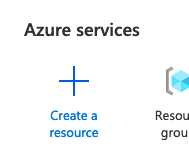
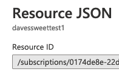

# Importing Existing Resources into State

## Expected Outcome

State is important to the Terraform workflow. Sometimes you have resources that were created outside Terraform that you'd like to manage with Terraform. You will learn how to create a simple Terraform configuration to represent these unmanaged resources, then import them using the Terraform CLI so they can be managed by Terraform.

## How To
1. Login to the [Azure Portal](https://portal.azure.com).
1. Using the portal, create a new Resource Group with a name and location of your choice. You don't need to add tags because we won't be importing them.

    
1. Using the portal, create a new VNet with a CIDR range "10.0.0.0/16". Make sure the VNet belongs to the Resource Group you just created!

1. These 2 resources, the Resource Group and VNet, represent cloud resources that were created outside of Terraform. We now want to manage them via Terraform...

### Step 1: Create the Resources in Terraform

You will create a `main.tf` file with the following:
1. A `terraform {}` block declaring the version of Terraform to use as well as the `azurerm` provider within the `required_providers` block.
1. An `azurerm` block for the provider configuration.
1. A [Resource Group](https://registry.terraform.io/providers/hashicorp/azurerm/latest/docs/resources/resource_group) with the same name and location as the Resource Group you created via the portal.
1. A VNet resource with the same name, location, resource group, and CIDR range as the one you created in the  portal.

### Run Terraform Workflow

1. Run `terraform init` and `terraform plan`... what do you notice about your plan?
1. Run a `terraform apply -auto-approve` (don't ever do this in production, by the way!)... what happens?

### Understanding State, Resource Addressing, and Import for Azure

1. In order for Terraform to "know" about these resources, and thus, how to manage them, we have to import them. Thankfully, there are a handful of commands in the Terraform CLI that make working with state easier. If you're ever managing the statefile by hand, then you're either doing something very specific or you should rethink what you're doing!
1. The first thing to do is look at the command to import your specific resource. Fortunately, these commands are at the bottom of each of the resources.
    1. [Import Resource Group](https://registry.terraform.io/providers/hashicorp/azurerm/latest/docs/resources/resource_group#import)
    1. [Import VNet](https://registry.terraform.io/providers/hashicorp/azurerm/latest/docs/resources/virtual_network#import)
1. To understand what you're importing and where, it helps to understand [Resource Syntax](https://www.terraform.io/language/resources/syntax#resource-syntax), specifically, the resource "type" and "local name" as these are used to key a Terraform-defined resources to an actual resource in the cloud.
    1. e.g., a resource block defined in Terraform as `resource "azurerm_resource_group" "main" {}`, `azurerm_resource_group` is the type and `main` is the local name. The local name can be whatever you want, but it must be unique for that resource (unless you're using a meta-argument, such as "count").
1. The other piece of the import command is going to be defined by the resource-specific import command. In MANY (most?) cases, it's going to be some identifier in the cloud that uniquely identifies the resources. In Azure, resource IDs align to API endpoints. Most of the resources you encounter in Azure will be "namespaced" by both a subscription id and a resource group. [Further Reading](https://docs.microsoft.com/en-us/azure/azure-resource-manager/management/overview)
1. There are a couple of ways to retrieve the ID of a resource:

    1. Via the portal, typically on the "Overview" page of the resource. Sometimes the JSON View helps, if available.

        

    1. Via the Resource Explorer in the portal. I find it's easiest to use the SEARCH bar in the portal to locate it.
    
        

### Import Resources

1. Import the Resource Group (your resource ID will vary)
  ```sh
  terraform import azurerm_resource_group.main /subscriptions/0174de8e-22d8-4082-a7a6-f4e808c60c08/resourceGroups/davessweettest1
  ```
1. Import the VNet (your resource ID will vary)
  ```sh
  terraform import azurerm_virtual_network.main /subscriptions/0174de8e-22d8-4082-a7a6-f4e808c60c08/resourcegroups/davessweettest1/providers/Microsoft.Network/virtualNetworks/davesvnet1
  ```

### Validate Imports
1. Each import command you run should give you feedback as to whether or not the import succeeded.
  ```sh
  root@d7190a4a4411:/app/Day2/201-state-import/solution# terraform import azurerm_resource_group.main /subscriptions/0174de8e-22d8-4082-a7a6-f4e808c60c08/resourceGroups/davessweettest1
  azurerm_resource_group.main: Importing from ID "/subscriptions/0174de8e-22d8-4082-a7a6-f4e808c60c08/resourceGroups/davessweettest1"...
  azurerm_resource_group.main: Import prepared!
    Prepared azurerm_resource_group for import
  azurerm_resource_group.main: Refreshing state... [id=/subscriptions/0174de8e-22d8-4082-a7a6-f4e808c60c08/resourceGroups/davessweettest1]

  Import successful!

  The resources that were imported are shown above. These resources are now in
  your Terraform state and will henceforth be managed by Terraform.
  ```
1. Try importing the same resource more than once, what happens?
1. Note that the import requires you to be authenticated against the provider because it actually reaches out to the cloud API to check for the resource.
1. A way to validate your import succeeded is to run a `terraform plan`... why? Because a plan that comes back with `No Changes` is a good indicator that your import has succeeded. That means your Terraform codebase is inline with the statefile, at least.

### Apply Terraform
1. The last step is to run `terraform apply` and verify that you get a clean run. At this point, your resources are now managed with Terraform! Don't forget to destroy them when you're done (using Terraform, of course)!
